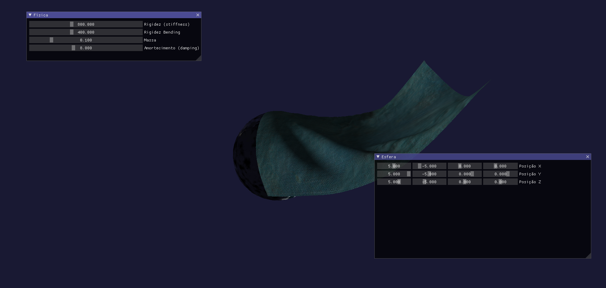

# Simulação de Tecido com GLSL

Este projeto consiste numa simulação de tecido (cloth simulation) utilizando GLSL, com shaders personalizados para renderização realista e efeitos visuais avançados. O trabalho foi desenvolvido no contexto da unidade curricular de Visualização em Tempo Real (VTR).


## Exemplo de Simulação



## Estrutura do Projeto

- **shaders/**: Shaders GLSL para simulação e renderização do tecido e da Terra.
  - `cloth.vert`, `cloth.geom`, `cloth.frag`, `cloth.comp`: Shaders para o tecido.
  - `earth.vert`, `earth.frag`: Shaders para renderização da Terra.
  - Outros shaders para efeitos de ruído e texturas.
- **buffers/**: Ficheiros de dados para buffers de posições, normais, forças, velocidades, etc.
- **generator/**: Scripts para geração de grids e dados auxiliares.
- **materials/**: Materiais utilizados na simulação (ex: Cloth, Earth).
- **objects/**: Objetos 3D utilizados na cena.
- **perlin/**: Shaders e ficheiros para geração de ruído Perlin.
- **main.xml**: Ficheiro de configuração principal da cena.
- **materials.mlib**: Biblioteca de materiais.

## Funcionalidades

- Simulação física de tecido com interação de forças, colisões e gravidade.
- Renderização realista com iluminação, normais e texturas.
- Utilização de shaders de geometria para geração de faces duplas (frente e verso do tecido).
- Efeitos de ruído procedural (Perlin) para texturas e superfícies.
- Visualização de materiais e objetos 3D.

## Como Correr o Projeto

1. **Pré-requisitos:**
   - OpenGL 4.3+
   - Python 3
   - Ambiente de desenvolvimento compatível
2. **Gerar buffers:**
   - Executar os scripts em `generator/` para gerar os ficheiros de buffers necessários.
3. **Compilar e correr:**
   - Compilar o projeto na Nau (https://github.com/Nau3D/nau)

## Créditos

Trabalho realizado por Gonçalo Barroso para a unidade curricular de Visualização em Tempo Real (VTR).

## Estrutura de Pastas

```
├── shaders/
├── buffers/
├── generator/
├── materials/
├── objects/
├── perlin/
├── main.xml
├── materials.mlib
```